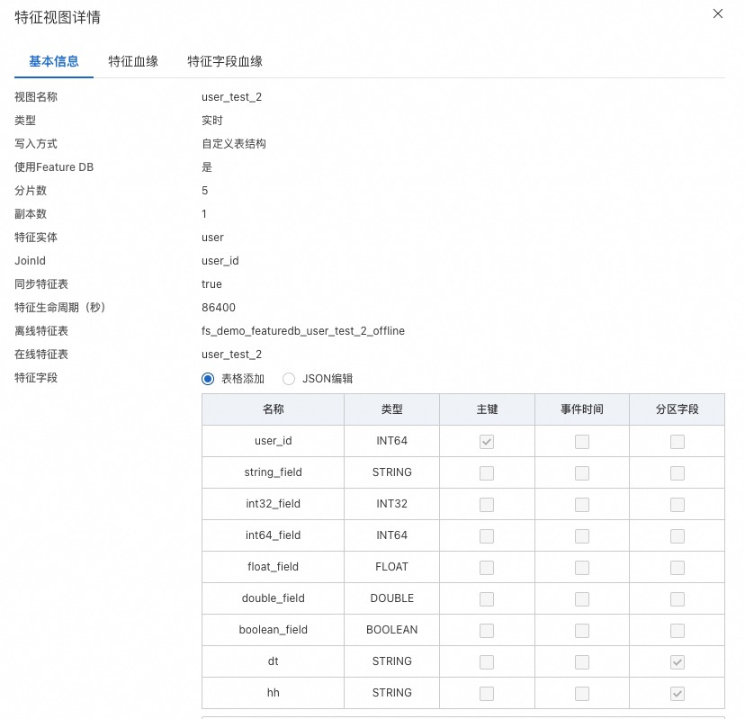

# aliyun-pai-featurestore-java-sdk


[PAI-FeatureStore 文档](https://help.aliyun.com/zh/pai/user-guide/featurestore-overview?spm=a2c4g.11186623.0.0.60b5329099wa5f)

## 导入依赖
```
<dependency>
  <groupId>com.aliyun.openservices.aiservice</groupId>
  <artifactId>paifeaturestore-sdk</artifactId>
  <version>1.2.2</version>
</dependency>
```
## 使用方式

### 1. 初始化客户端

```java
public class Constants {
    public static String accessId = "";
    public static String accessKey = "";

    static {
        accessId = System.getenv("ALIBABA_CLOUD_ACCESS_KEY_ID");
        accessKey = System.getenv("ALIBABA_CLOUD_ACCESS_KEY_SECRET");
    }
}

// 配置regionId、accessId、accessKey以及项目名称
Configuration configuration = new Configuration("cn-hangzhou",Constants.accessId,Constants.accessKey,"dec6");  
// 如果通过 featuredb 读取或者写入数据源，需要配置 featuredb 用户名、密码
//configuration.setUsername("featuredb username");
//configuration.setPassword("featuredb password");
ApiClient apiClient = new ApiClient(configuration);  
FeatureStoreClient featureStoreClient = new FeatureStoreClient(apiClient);  
```

由于 SDK 是直连 onlinestore 的， client 需要在 VPC 环境运行。 比如 hologres/graphcompute , 需要在指定的 VPC 才能连接。

初始化FeatureStoreClient客户端时，默认入参false代表 VPC 环境运行。
如果是本地调试（非vpc环境），入参改为true即可。
```java
// 如果是本地调试，vpc 连接不通的话，可以直接使用公网地址, 但生产环境，一定要用 vpc 地址 
FeatureStoreClient featureStoreClient = new FeatureStoreClient(apiClient, true);  

// FeatureStoreClient 也需要与 FeatureStore Server 进行交互，获取各种元数据信息。默认也是通过 vpc 进行连接，如果通过公网，可以显式的设置
configuration.setDomain("FeatureStore Server 的公网地址");
```

| 地域                  | vpc 地址                                       | 公网地址                                     |
|---------------------|----------------------------------------------|------------------------------------------|
| 北京(cn-beijing)      | paifeaturestore-vpc.cn-beijing.aliyuncs.com  | paifeaturestore.cn-beijing.aliyuncs.com  |
| 杭州(cn-hangzhou)     | paifeaturestore-vpc.cn-hangzhou.aliyuncs.com | paifeaturestore.cn-hangzhou.aliyuncs.com |
| 上海(cn-shanghai)     | paifeaturestore-vpc.cn-shanghai.aliyuncs.com | paifeaturestore.cn-shanghai.aliyuncs.com |
| 深圳(cn-shenzhen)     | paifeaturestore-vpc.cn-shenzhen.aliyuncs.com | paifeaturestore.cn-shenzhen.aliyuncs.com |
| 新加坡(ap-southeast-1) | paifeaturestore-vpc.ap-southeast-1.aliyuncs.com    | paifeaturestore.ap-southeast-1.aliyuncs.com      |


### 2. 获取 FeatureView 的特征数据

``` java
// get project by name
Project project=featureStoreClient.getProject("dec6");  
if(project==null){  
  throw new RuntimeException("Project not found");  
} 

// get feature view by name
FeatureView featureView=project.getFeatureView("zh1");  
if (featureView == null) {  
  throw new RuntimeException("FeatureView not found");  
}  

// get features 
FeatureResult featureResult1 = featureView.getOnlineFeatures(new String[]{"101597737", "101683773", "101724226"},new String[]{"*"},nil);
```
遍历返回的特征数据

```java
  //输出特征信息
  while(featureResult1.next()){
     for(String m:featureResult1.getFeatureFields()){// feature field name
         System.out.print(String.format("%s='%s'(%s) ",m,featureResult1.getObject(m),featureResult1.getType(m)));
     }
     System.out.println("---------------");
 }

//get sequencefeature by name
FeatureView hol_seq = dec15.getFeatureView("seq_test2");
      if(hol_seq==null){
          throw new RuntimeException("This featureView is not exist");
      } 
```
序列化特征数据
                      
```java
//序列化特征
SequenceFeatureView hol_seq = dec15.getSeqFeatureView("seq_test2");
if (hol_seq==null) {
    throw new RuntimeException("This featureView is not exist");
}
//获取序列化数据
FeatureResult features2 = hol_seq.getOnlineFeatures(new String[]{"100433245", "100433233"});
System.out.println("[");
for (Map<String, String> m:features2.getSeqfeatureDataList()) {
    System.out.println("{");
    for (Object key:m.keySet()){
        System.out.println(key+":"+m.get(key));
        System.out.print(",");
    }
    System.out.println("}");
}
System.out.println("]");

```


### 3. 获取模型特征
``` java
// get model by name
Model model=project.getModelFeature("model_t1");  
if(model==null){  
		throw new RuntimeException("Model not found");   
}
// 以两个join_id实例(user_id,item_id)，传入的值个数需对应
Map<String, List<String>> m2=new HashMap<>();  
m2.put("user_id",Arrays.asList("101597737","101683773","101724226"));  
m2.put("item_id",Arrays.asList("200111753","200124053","200318864"));

// get features 
FeatureResult featureResult2 = model.getOnlineFeatures(m2);  
```
ModelFeature 可以关联多个 FeatureEntity, 可以设置多个 join_id, 然后特征统一返回。

示例中有两个 join_id, user_id 和 item_id 。 获取特征的时候需要设置相同的 id 数量。

也可以指定某个 FeatureEntity, 把 FeatureEntity 对应的特征一块返回。

```java
Map<String, List<String>> m3=new HashMap<>();  
m3.put("user_id",Arrays.asList("101597737","101683773","101724226"));  
FeatureResult featureResult3 = model.getOnlineFeaturesWithEntity(m3,"user");  
```

上面的含义是把 ModelFeature 下的 user(FeatureEntity) 对应的特征全部获取到。

### 4. 写入数据到 FeatureStore
目前写入接口只支持在线数据源为 FeatureDB, 并且是实时特征。 
假设有如下的实时 featureview 定义 


写入示例参考:
```java
// 配置 regionId, 阿里云账号, FeatureStore project
       Configuration configuration = new Configuration("cn-beijing",
                Constants.accessId, Constants.accessKey,"fs_demo_featuredb" );

        // 配置 FeatureDB 用户名，密码
        configuration.setUsername(Constants.username);
        configuration.setPassword(Constants.password);

        // 如果使用公网链接 FeatureStore, 参考上面的域名信息
        // 如果使用 VPC 环境，不需要设置
        //configuration.setDomain(Constants.host);

        ApiClient client = new ApiClient(configuration);

        // 如果使用公网链接 设置 usePublicAddress = true, vpc 环境不需要设置
        // FeatureStoreClient featureStoreClient = new FeatureStoreClient(client, Constants.usePublicAddress);
        FeatureStoreClient featureStoreClient = new FeatureStoreClient(client );

        Project project = featureStoreClient.getProject("fs_demo_featuredb");
        if (null == project) {
            throw  new RuntimeException("project not found");
        }

        FeatureView featureView = project.getFeatureView("user_test_2");
        if (null == featureView) {
            throw  new RuntimeException("featureview not found");
        }

        List<Map<String, Object>> writeData = new ArrayList<>();
        // 模拟构造数据写入 
        for (int i = 0; i < 10; i++) {
            Map<String, Object> data = new HashMap<>();
            data.put("user_id", i);
            data.put("string_field", String.format("test_%d", i));
            data.put("int32_field", i);
            data.put("int64_field", Long.valueOf(i));
            data.put("float_field", Float.valueOf(i));
            data.put("double_field", Double.valueOf(i));
            data.put("boolean_field", i % 2 == 0);
            writeData.add(data);
        }

        for (int i = 0; i < 100;i++) {
            featureView.writeFeatures(writeData);
        }

        // 这里只需要调用一次，如果全部数据写完，确保全部写入完成，调用此接口后，无法再调用 writeFeatures 
        featureView.writeFlush();

```
目前 SDK 也支持部分字段的写入。 上面的例子中，调用 writeFeatures 方法，默认是整行替换的，哪怕 writeData 中只包含部分字段。如果只想部分字段
的更新，可以调用指定 InsertMode 写入模式, 参数 InsertMode.PartialFieldWrite。
````java
        for (int i = 0; i < 100;i++) {
            featureView.writeFeatures(writeData, InsertMode.PartialFieldWrite);
        }
````


## 版本说明
### 1.2.1 (2025-08-14)
* 增加了访问featurestore可以使用vpc高速连接的支持
* 去除了close时FeatureStoreClient被清理的逻辑 
 
### 1.2.0 (2025-07-02)
* 修复了读取sequence featureview read nullpointer异常 
 
### 1.1.7 (2025-06-04)
* 增加了使用 sts 方式调用
 
### 1.1.6 (2025-05-29)
* 优化了ots的读取逻辑，去掉多线程调用 
 
### 1.1.5 (2025-02-05)
* 增加了行为 featureview 可以引用行为表的支持   
 
 
### 1.1.4 (2024-11-25)
* client 增加了 close function 
* 修复了 getOnlineFeaturesWithEntity 中特征字段为 null 抛异常的情况 
 
### 1.1.3 (2024-11-11)
* 使用懒加载方式初始化meta信息,只有用到相关的资源才会加载
* 优化 getOnlineFeatures 和 getOnlineFeaturesWithEntity 接口性能 
 
### 1.1.1 (2024-10-31)
* 修复FeatureEntity数量过多，读取特征报空指针错误
* 增加部分字段写入FeatureDB 的支持
 
### 1.1.0 (2024-09-13)
* FeatureDB 增加复杂类型(MAP/ARRAY)特征的读取及写入
 
### 1.0.9 (2024-09-03)
* 增加通过 FeatureDB 获取序列特征的支持 
 
### 1.0.8 (2024-08-19)
* 修复特征不在 TableStore 时，报 NullPointerException 
 
### 1.0.6 (2024-05-28)
* 增加写入 FeatureDB 的支持
 
### 1.0.5 (2024-04-08)
* 增加 FeatureDB 的支持
* 优化了并行处理的性能

### 1.0.4 (2024-03-13)
* 解决 tablestore 依赖 protofbuf 版本问题(参考[这里](https://help.aliyun.com/zh/tablestore/support/what-do-i-do-if-pb-library-conflicts-occur-when-i-use-tablestore-sdk-for-java))
 
### 1.0.3 (2024-02-20)
* 支持公网访问获取数据
* 支持序列特征获取

